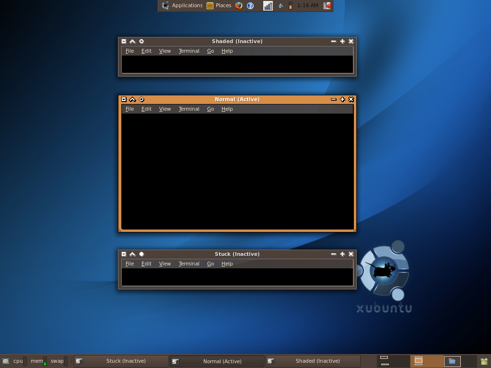

# Coda
Simple XFce Theme meant to have simple, 3-dimensional window buttons and a straightforward interface.

## Install
View the [project wiki](https://github.com/CITguy/legacy-linux-customizations/wiki#installing-xfce-themes) for details.

## Screenshots

**Coda with "DarkRoom" GTK Theme**

**Coda with "redmondxp" GTK Theme**

