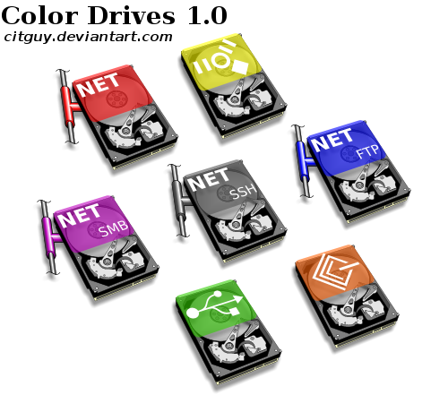

# ColorDrives Icons (v1)

Twelve isometric, hard-disk drive icons in 7 colors.

* `Generic`
* `FireWire`
* `FTP`
* `HTTP`
* `HTTPS`
* `Net Generic`
* `Net Generic - Alternate`
* `SCSI`
* `SFTP`
* `SMB`
* `SSH`
* `USB`

