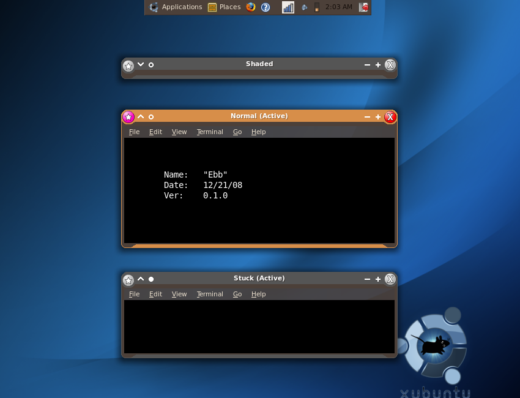
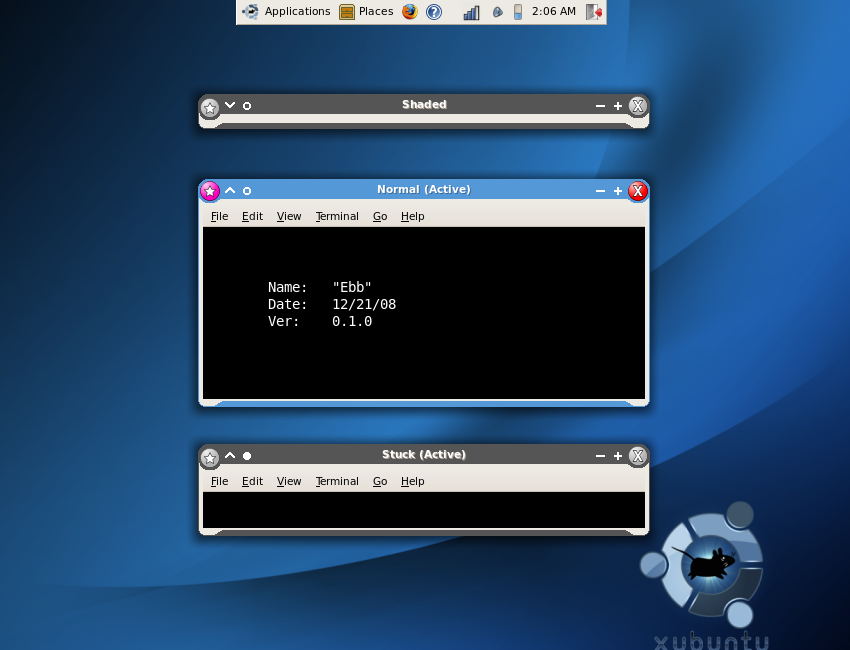
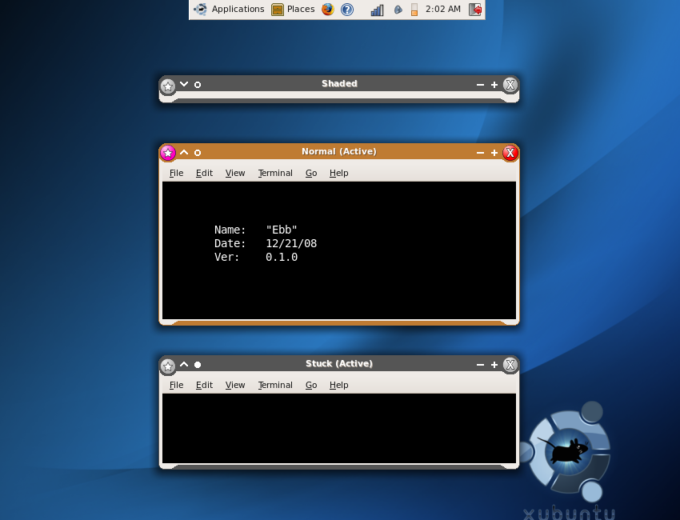
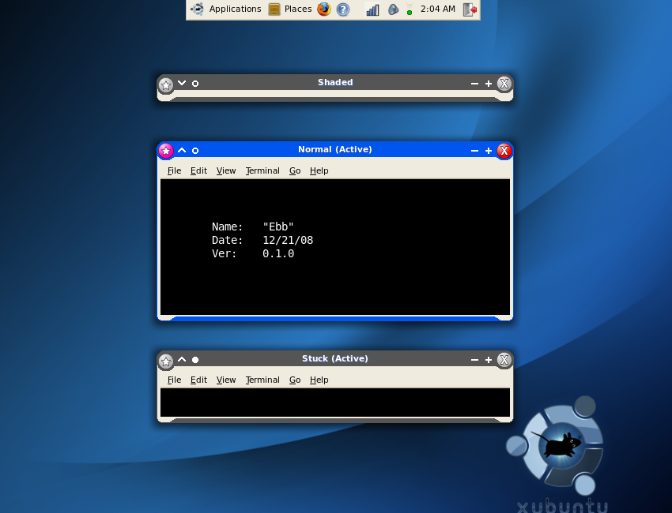

# Ebb
Mismatched window button theme for the Xfce Window Manager.

## Install
View the [project wiki](https://github.com/CITguy/legacy-linux-customizations/wiki#installing-xfce-themes) for details.

## Screenshots

**Ebb (DarkRoom gtk theme)**

**Ebb (Glossy gtk theme)**

**Ebb (Human gtk theme)**

**Ebb (redmondxp gtk theme)**

## Notes
(2021-03-31): Converted XAR to SVG, but broke "highlight" due to XAR transparency and lack of support in Xara Xtreme to export using SVG filters.

## LICENSE
Copyright (C) 2009 Ryan Johnson
