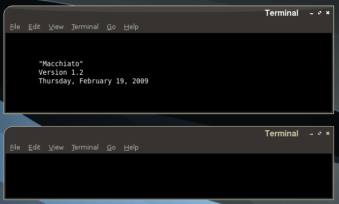
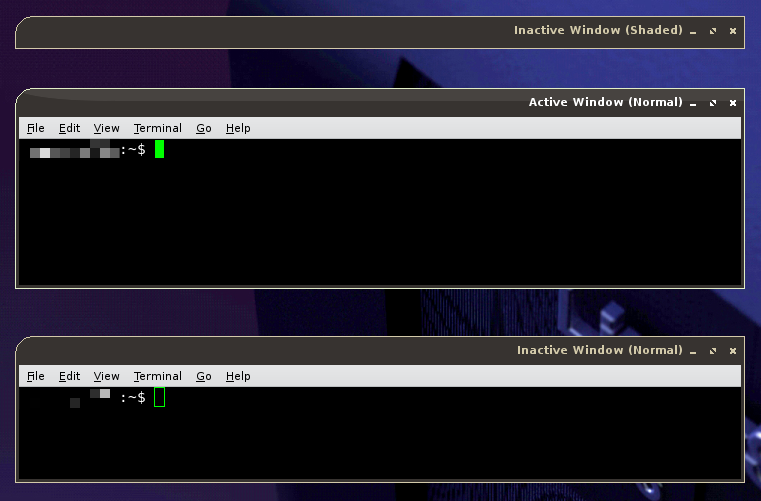

# Macchiato Theme


## Window Manager Themes
Ports of the Macchiato Emerald theme.

These themes were developed for fun.  They're based on the
[Macchiato Emerald Theme](https://opendesktop.org/content/show.php/Macchiato?content=96151)
posted on OpenDesktop.org by SpecKtacle.


### Metacity Theme (v1.2)

`src/metacity-1/`



This theme contains definitions for both Version 1 and Version 2 Metacity
themes.  However, it looks best in the Version 2 form.  There are additional
buttons that you can specify to show on the window, however you must configure
your system to display them.


#### Configuration
For some systems that impliment GNOME, the Metacity Version 2 Features may be
enabled, but not all of the Version 2 buttons will show up.  To fix this, open
`gconf-editor`, then navigate to `apps > metacity > general`.  The setting you
want to change is `button_layout`.  Use the following list to change your layout.

- `menu`
- `:` (window title)
- `stick`
- `above`
- `shade`
- `minimize`
- `maximize`
- `close`

_Example:_

```
menu,stick,above,shade:minimize,maximize,close
```

The above value will have the `menu`, `stick`, `above`, and `shade` buttons on
the left hand side of the title, while the `minimize`, `maximize`, and `close`
buttons are on the right side of the title.


### XFwm Theme (v1.2)

`src/xfwm4/`



TL;DR -- Buttons must **always** be to the _right_ of the title.


To pull off the title gloss effect seen in the emerald theme, a trick was used.
Since the different title sections are drawn differently depending on the button
configuration, title-1 is never seen (as it is the background for the left
buttons) and the top-left and title-2 are drawn right next to each other. This
allowed me to get that swooping curve for the gloss effect.  However, because of
this trick, this theme will NOT work for any configuration with buttons to the
left of the title.

This is an unfortunate limitation of the XFce Window Manager.  Maybe future
updates will fix this.


## GTK Theme (r1.0)
**NOTE:** I'm not sure if this actually works. Use at your own risk.

`src/gtk-2.0/`

Attempt at a GTK theme for use along with either window manager theme
managers.


## LICENSE
Copyright 2007 Ryan Johnson
